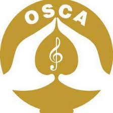

---
# WHERE IS **OSCA**?
**Outstanding Song Creator’s Association** (OSCA) 
| E-mail   | cineoscasl@gmail.com|
| ----------- | ----------- |
| Tel      | 0094 11 230 5070|
| Tel/ Fax   | 0094 11 230 4070|
| Address      | No. 73, Sir James Peiris Mawatha, Colombo 02 |
  
---

# WHO IS **OSCA**? 

Outstanding Song Creator’s Association (OSCA) is a non-profit organization devoted to artists who express themselves through aesthetics songs. It is also a Collective Management Organization (CMO) because they collect royalties for their members’ (singers, composers, songwriters) songs. This organization is registered with the Sri Lanka Institute of Company Registration.

OSCA seeks to maintain its membership's professional integrity, reputation, and stability. According to OSCA, the Sinhala song and its three basic components, lyrics, music composition, and voice representation, strive to carve out a niche on the world arena.
 

---

# WHY IS **OSCA**?

They don’t have a system for their members to get ideas about the transparency of royalties. And the employees in OSCA as well as the show organizers have to go through with the time-consuming process when applying licenses for concerts manually. OSCA members have zero motivation when getting a membership and updating their change song ownerships. OSCA members (artists) never want to register their songs anywhere. Because of that OSCA Officials have to spend more time when getting information for the licenses.

By experiencing the above issues, as Computer Science undergraduates we decided to implement a system that would help OSCA regarding the above problems right away.

<strong>Our project is to automate the OSCA's manual system</strong> which is hectic and time-consuming. By making this system, we are expecting to solve all the above-mentioned problems using the automated system. After implementing this system, OSCA members can see their monthly and annual income and which songs they got royalty with full transparency. Apply licenses process would be automated with easy-going for both OSCA Officials and show organizers. For the first time, all the members will register their songs in the system up to date. 
 

---

# **WHAT ARE WE GONNA DO?**
In OSCA, there are four main users for this system.
- Admin (Director)
- OSCA Officials (other staff)
- Members (registered artists)
- Show Organizers (the person who does concerts)

So,
- We are providing a platform for show organizers where they can apply for a license. On that platform, they can include the songs they want to perform in their concert. Also, they can cancel any license they applied for within a given time period.
- We are providing a platform for the show organizers where they can do online payments.
- We are providing a platform for artists and OSCA officials where they can register their new songs and also, they can change the ownership for their songs.
- We are providing a platform for show organizers, artists, OSCA officials, and directors to see their upcoming events.
- We are providing a platform for the director where they can change the commission percentage for OSCA from licenses. Also, they can change the documentation fee for OSCA from the license cancellation.
 
As well as following things also will be included in the system.
- The mobile application will be developed only for members for viewing their past received payments and future payments that are to be received. So, they can get a transparent idea about how they get their royalty for their songs.
- Login and authentication module
- Online payment module - when the applying licenses
- Smart calendar - to check upcoming events
- Report generate module - to generate reports for Admin, OSCA Officials, Member and, Show Organizers about their monthly/annual payments/incomes
- SMS module - sending verification code when forgetting passwords
- Database - Admin, OSCA official, member, show organizer, licenses (applied/ approved/ rejected), registered songs details
 

In addition to that, the membership application to the OSCA won’t be handled by the system, and the relevant payment value for each artist will be generated by the system but the financial transaction for the artist won’t be handled by the system.
 

---

# **WHAT WILL THEY GET FROM US**

For the project, we will achieve the following things at the end.
- Develop the above-mentioned system with all fully functional components.
- Solve all the identified issues related to royalty collecting and make everyone fully satisfied using our system.
- Notifying the artists when their songs are selected by a show organizer. And also, artists can see their past received payments and future payments that are to be received in their profile.
- Make the system as ‘user-friendly' as feasible for every user by designing straightforward user interfaces. Thus, show organizers, artists, OSCA officials, and directors can perform their tasks with the system easily and efficiently.
 
End of our project, the following things we will be delivered to the OSCA.
- A *web application* for each user with user-friendly interfaces where they can manage all their functionalities
- A *mobile application* with user-friendly interfaces only for the members to check their past and upcoming incomes.
- A *user guide* for maintenance purposes.
- Technical documents (SRS and SDS report). 

  

---

# **Team members**

### **CS 04** 
| Index Number   |Name|
| ----------- | ----------- |
| 19000049      | ABHISHEK K.K.L|
| 19000944   | MARASINGHE O.E|
| 19001101      | PATHIRAJE P.M.D.D |
| 19001827      | WALPITA GAMAGE I.N |

---