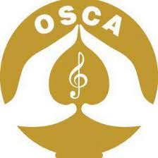

 
 

# WHO IS **OSCA**? 

<b>Outstanding Song Creator’s Association (OSCA)</b> is a non-profit organization devoted to artists who express themselves through aesthetics songs. It is also a Collective Management Organization (CMO) because they collect royalties for their members’ (singers, composers, songwriters) songs. This organization is registered with the Sri Lanka Institute of Company Registration.

 
 
 

# WHERE IS **OSCA**?
**How to contact :**
| E-mail   | cineoscasl@gmail.com|
| ----------- | ----------- |
| Tel      | 0094 11 230 5070|
| Tel/ Fax   | 0094 11 230 4070|
| Address      | No. 73, Sir James Peiris Mawatha, Colombo 02 |

 
 
 

# WHY IS **OSCA**?

They don’t have a system for their members to get ideas about the transparency of royalties. OSCA members have zero motivation when getting a membership and updating their change song ownerships. OSCA Officials have to spend more time when getting information for the licenses.

<strong>Our project is to automate the OSCA's manual system</strong>. By making this system, we are expecting to solve all the above-mentioned problems using the automated system. After implementing this system, OSCA members can see their monthly and annual income and which songs they got royalty with full transparency. Apply licenses process would be automated with easy-going for both OSCA Officials and show organizers. For the first time, all the members will register their songs in the system up to date. 

 
 
 

## WHAT ARE WE GONNA DO?
---
In OSCA, there are four main users for this system.
- Admin (Director)
- OSCA Officials (other staff)
- Members (registered artists)
- Show Organizers (the person who does concerts)

So,
- We are providing a platform for show organizers, artists, and OSCA.
  

As well as following things also will be included in the system.
- The mobile application will be developed only for members.
- Login and authentication module
- Online payment module - when the applying licenses
- Report generate module - to generate reports for Admin, OSCA Officials, Member and, Show Organizers about their monthly/annual payments/incomes
- SMS module - sending verification code when forgetting passwords
- Database - Admin, OSCA official, member, show organizer, licenses (applied/ approved/ rejected), registered songs details
 
 
 
 

# FROM US

End of our project, the following things we will be delivered to the OSCA.
- A *web application* for each user with user-friendly interfaces where they can manage all their functionalities
- A *mobile application* with user-friendly interfaces only for the members to check their past and upcoming incomes.
- A *user guide* for maintenance purposes.
- Technical documents (SRS and SDS report).

 

---